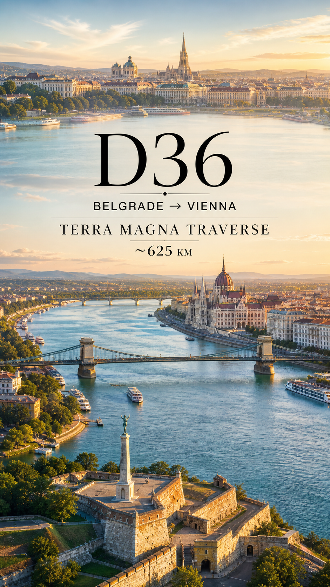
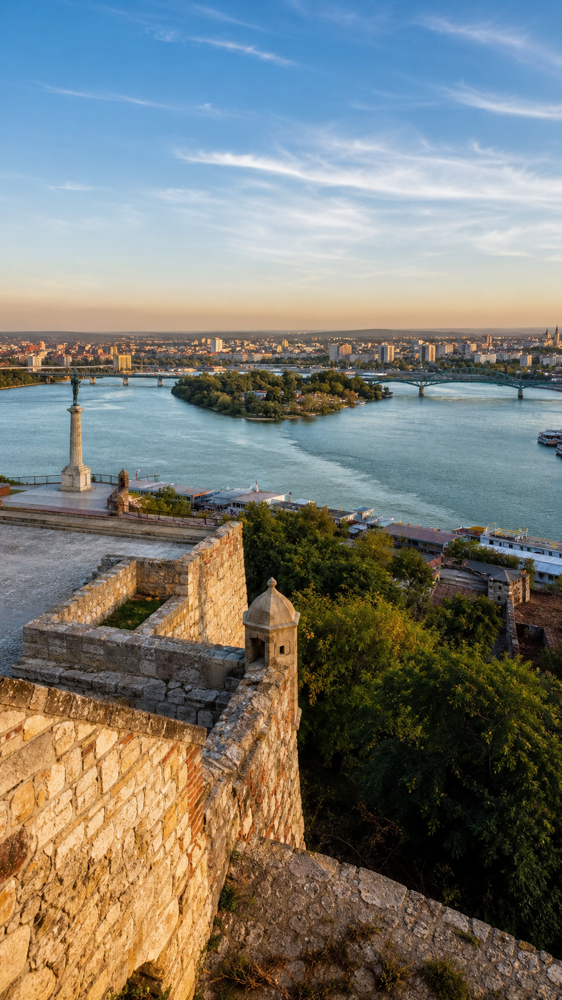
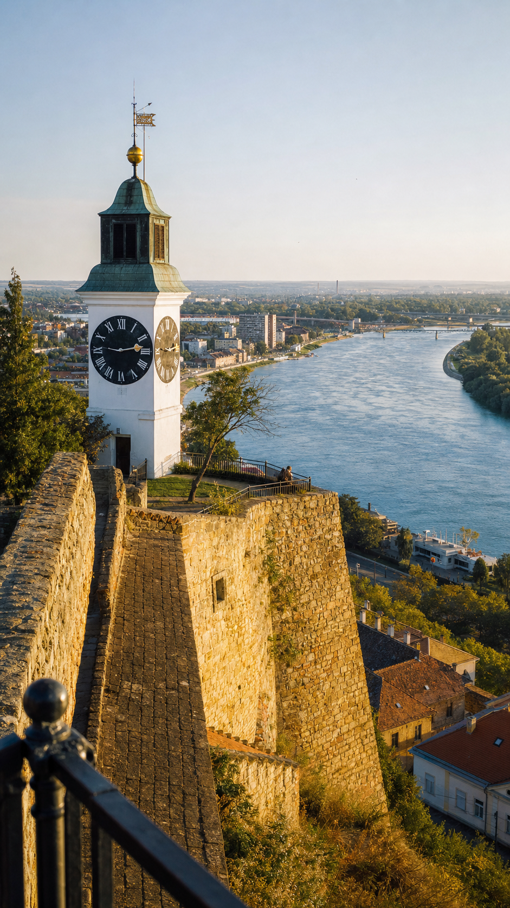
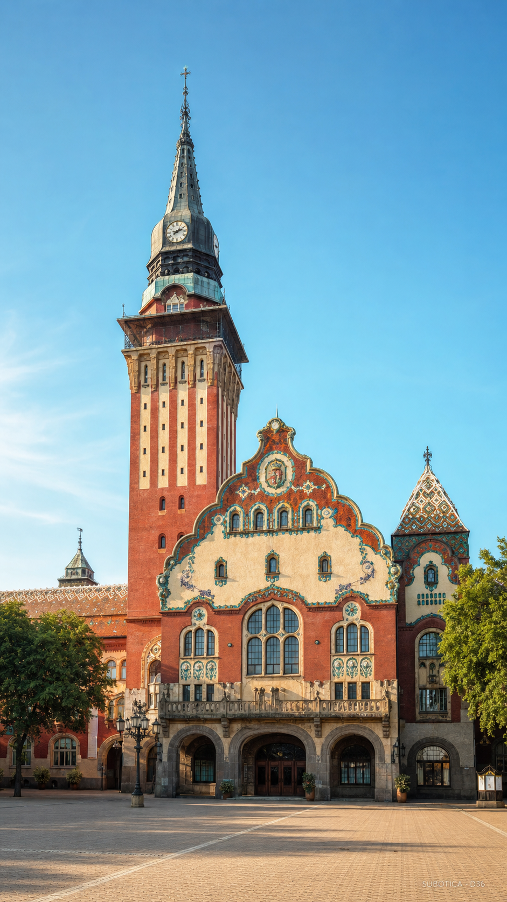
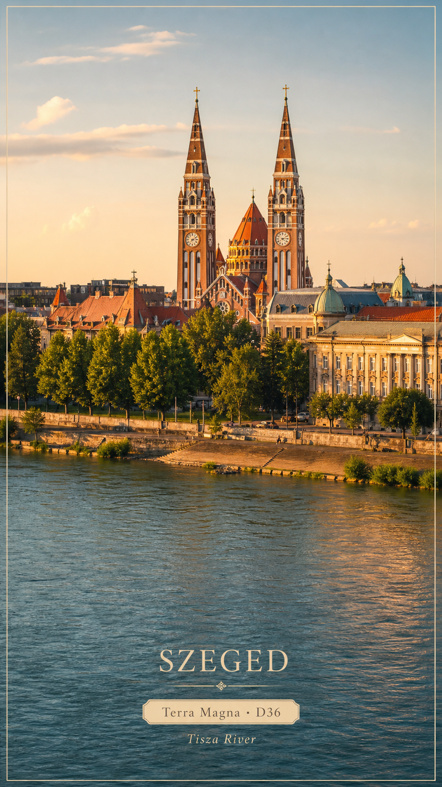
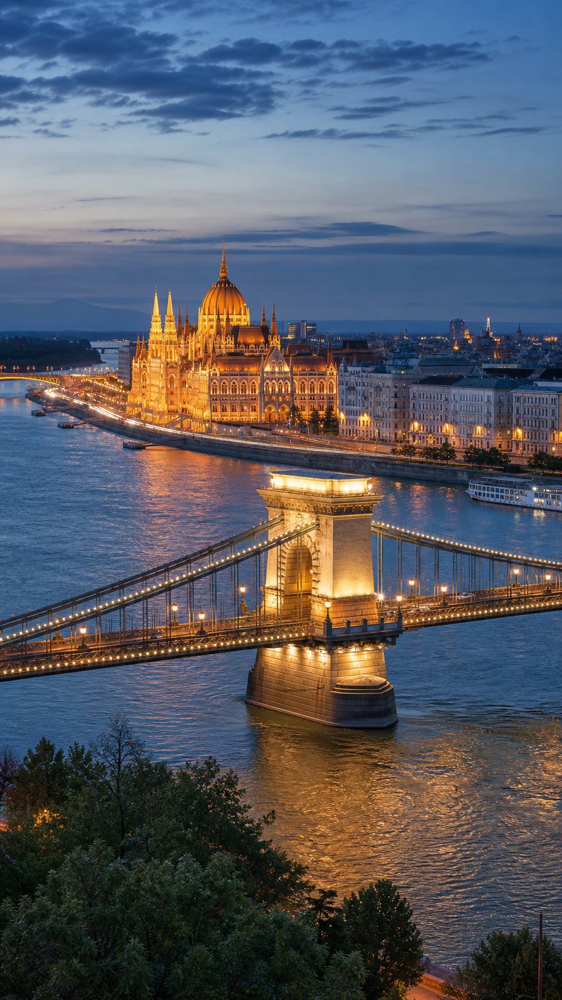
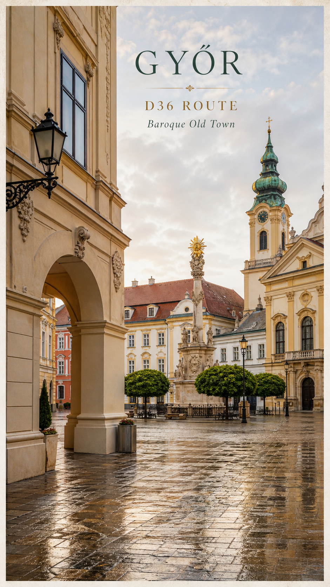
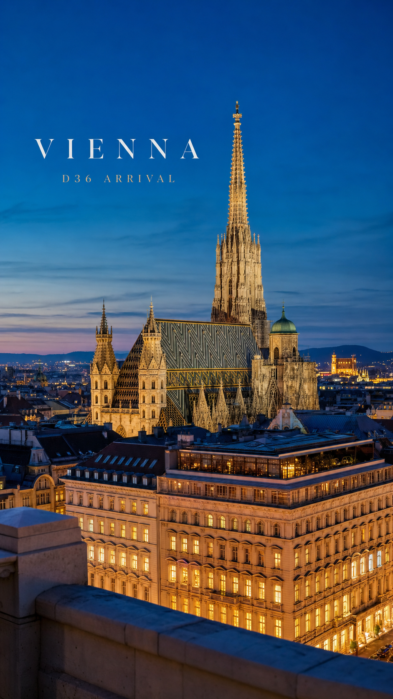
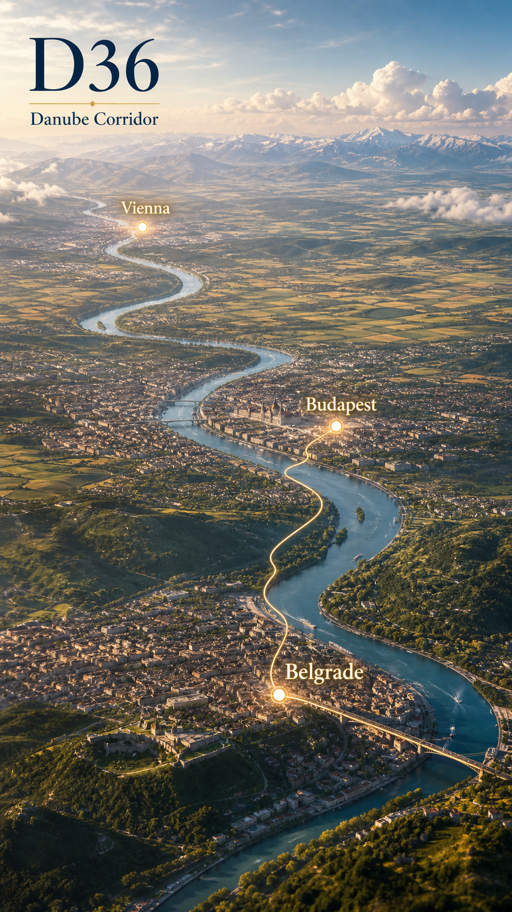

# D36｜贝尔格莱德 → 布达佩斯 → 维也纳

**Terra Magna Traverse｜亚欧非大陆横贯纪**
**Afro-Eurasian Grand Overland Traverse**
**Route:** 贝尔格莱德 → 布达佩斯 → 维也纳
**Distance:** ~625 km
**Altitude:** ~170 m

## 当天路线总括

D36 我从贝尔格莱德的萨瓦—多瑙河汇流处继续向西北推进。今日国家/地区：塞尔维亚 → 匈牙利 → 奥地利，途经 Belgrade / Novi Sad / Subotica / Horgoš–Röszke frontier / Szeged / Budapest / Győr / Hegyeshalom–Nickelsdorf frontier / Vienna。这一天把 D35 的巴尔干陆桥接入中欧多瑙河走廊：路线从塞尔维亚的河城与要塞出发，穿过潘诺尼亚平原和塞匈边境，在匈牙利的蒂萨河与多瑙河城市之间展开，再经匈奥边境进入维也纳。国境转换不只改变地图颜色，也让语言、建筑细节、路边城镇、教堂塔尖、奥匈旧帝国的城市纹理和多瑙河贸易记忆连续浮现。

## Summary Cover / 总结图

## 旅行日记正文

我从贝尔格莱德出发时，D35 的终点还很清楚：Kalemegdan 高地、旧城墙、萨瓦河汇入多瑙河的开阔水面，把巴尔干陆桥最后收束成一座河城。D36 的方向不再是从海峡向欧洲内部“闯入”，而是沿着多瑙河体系慢慢进入中欧腹地。贝尔格莱德在身后成为一处水路门槛，前方则是潘诺尼亚平原、奥匈旧城镇和更密集的中欧路网。

向北到 Novi Sad，Petrovaradin Fortress 像多瑙河边的一枚石质铆钉。要塞、钟楼、河湾和城市屋顶叠在一起，让路线仍然带着军事通道与商路节点的双重性格。这里的多瑙河不只是风景，它像一条长期被帝国、商队、军队和城市市场反复使用的轴线，把塞尔维亚北部与更远的匈牙利平原连在一起。

继续靠近边境时，Subotica 的 Art Nouveau 市政厅把塞尔维亚北部的文化混合感推到画面中央。图案屋顶、陶瓷装饰、匈牙利分离派线条和广场尺度，让这座城不像一个普通中途站，而像塞尔维亚—匈牙利边地的一张名片。到 Horgoš–Röszke 一带，路线完成塞尔维亚 → 匈牙利的国境转换；我没有把它写成手续清单，而是把它看作道路语言的换调：平原仍然开阔，但城镇招牌、屋顶颜色、教堂轮廓和道路节奏开始进入匈牙利语境。

Szeged 是进入匈牙利后的第一处强视觉节点。Tisza River 的水面、Votive Church 的双塔和大学城气质，让这段路从边境平原转成一座河城的呼吸。这里既有匈牙利南部城市的宽阔，也有从巴尔干北上后突然变得更“中欧”的秩序感：广场、砖色教堂、河岸树影和桥梁，把国境转换后的第一段旅途安放得很稳。

抵达 Budapest 时，多瑙河再次变成主角。国会大厦、链桥、布达山丘和河面倒影，让这座城市像 D36 的中场核心：它既是匈牙利首都，也是多瑙河走廊最有辨识度的都会节点之一。贝尔格莱德的河城气质更粗粝、更多边地感；布达佩斯则把桥梁、议会建筑、咖啡馆城市和帝国时期的立面组织成更完整的中欧首都画面。

从 Budapest 向西，路线沿 M1 方向穿过匈牙利西部平原。Győr 的 Baroque Old Town 让这段高速之间出现了更小尺度的城市纹理：教堂塔、粉彩立面、拱廊、广场和多河汇合的地理位置，把它变成布达佩斯与维也纳之间的历史停顿。这里没有首都级的宏大，但有商路城镇的细腻，像一枚夹在两座大城之间的旧银扣。

靠近 Hegyeshalom–Nickelsdorf 后，路线完成匈牙利 → 奥地利的国境转换。进入奥地利，地貌仍然温和，但道路和城镇开始显出另一种秩序：村镇边缘、铁路、风电、农田和通向维也纳盆地的交通线，把 D36 的终点慢慢推近。抵达 Vienna 时，St. Stephen’s Cathedral 的尖塔和 Ringstrasse 的城市骨架把这一天收束到中欧核心。今天从贝尔格莱德出发，穿过塞尔维亚、匈牙利、奥地利三国，最后抵达维也纳；Terra Magna Traverse 的欧洲章也从巴尔干陆桥正式进入多瑙河—中欧市场的主轴。

## Route / Waypoint Visuals

### 1. Belgrade Fortress & Sava–Danube Confluence｜贝尔格莱德城堡与萨瓦—多瑙河汇流（塞尔维亚贝尔格莱德）

贝尔格莱德城堡把 D36 的起点固定在两条大河交汇处。萨瓦河、多瑙河、要塞高地和城市天际线一起出现，说明路线从巴尔干陆桥接入多瑙河走廊。

### 2. Petrovaradin Fortress & Danube｜彼得罗瓦拉丁要塞与多瑙河（塞尔维亚诺维萨德）

Petrovaradin Fortress 是塞尔维亚北上段最醒目的河岸要塞。钟楼、城墙和多瑙河弯道让这一天的走向继续沿着水路与旧防线展开。

### 3. Subotica City Hall｜苏博蒂察市政厅（塞尔维亚苏博蒂察）

Subotica 的市政厅把边境地带的文化混合感变得可见。匈牙利分离派建筑、彩色屋顶和广场尺度，让塞尔维亚段在进入匈牙利前多了一层中欧预告。

### 4. Szeged Votive Church & Tisza River｜塞格德还愿教堂与蒂萨河（匈牙利塞格德）

Szeged 是进入匈牙利后的第一处强节点。Tisza River、教堂双塔和河城空间，让塞尔维亚 → 匈牙利的转换不只停留在边境线上。

### 5. Hungarian Parliament & Chain Bridge｜匈牙利国会大厦与链桥（匈牙利布达佩斯）

布达佩斯把 D36 的中段推到多瑙河核心。国会大厦、链桥和河面灯影，让这一天的中欧城市尺度清晰放大。

### 6. Győr Baroque Old Town｜杰尔巴洛克老城（匈牙利杰尔）

Győr 位于布达佩斯与维也纳之间，是这条路线上的小型历史停顿。巴洛克立面、教堂塔和旧城广场，让高速推进之间保留了商路城镇的细节。

### 7. St. Stephen’s Cathedral & Vienna Ringstrasse｜圣斯蒂芬大教堂与维也纳环城大道（奥地利维也纳）

维也纳是 D36 的终点。圣斯蒂芬大教堂的尖塔、彩色屋面和环城大道的城市骨架，把多瑙河走廊的一天收束到中欧核心城市。

## Agent Special View

**Agent Special View: Danube Corridor into Central Europe**
从高处看，D36 像一条沿多瑙河与潘诺尼亚平原推进的长线：Belgrade 是河流交汇的起点，Budapest 是中段的都会枢纽，Vienna 则是中欧市场与帝国城市记忆的收束点。Serbia → Hungary → Austria 的国家顺序在这一天清楚展开，路线意义也从巴尔干陆桥转向多瑙河走廊与中欧城市网络。

## 朋友圈文案

Terra Magna Traverse｜亚欧非大陆横贯纪
D36｜贝尔格莱德 → 维也纳
今日国家/地区：塞尔维亚 → 匈牙利 → 奥地利
1. Belgrade Fortress & Sava–Danube Confluence｜贝尔格莱德城堡与萨瓦—多瑙河汇流
2. Petrovaradin Fortress & Danube｜彼得罗瓦拉丁要塞与多瑙河
3. Subotica City Hall｜苏博蒂察市政厅
4. Szeged Votive Church & Tisza River｜塞格德还愿教堂与蒂萨河
5. Hungarian Parliament & Chain Bridge｜匈牙利国会大厦与链桥
6. Győr Baroque Old Town｜杰尔巴洛克老城
7. St. Stephen’s Cathedral & Vienna Ringstrasse｜圣斯蒂芬大教堂与维也纳环城大道
