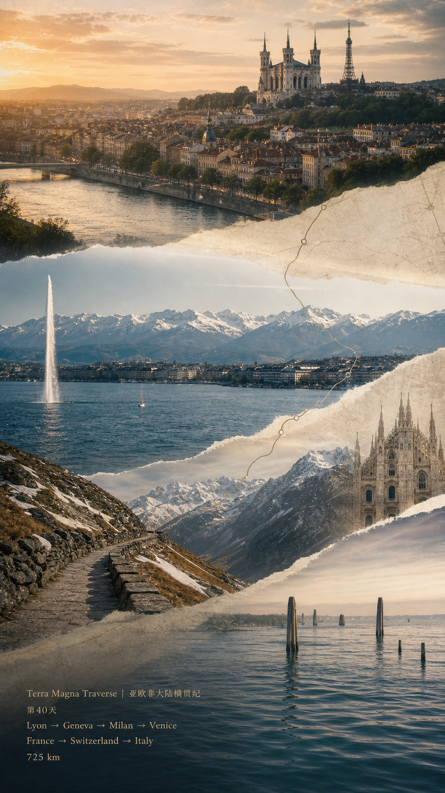
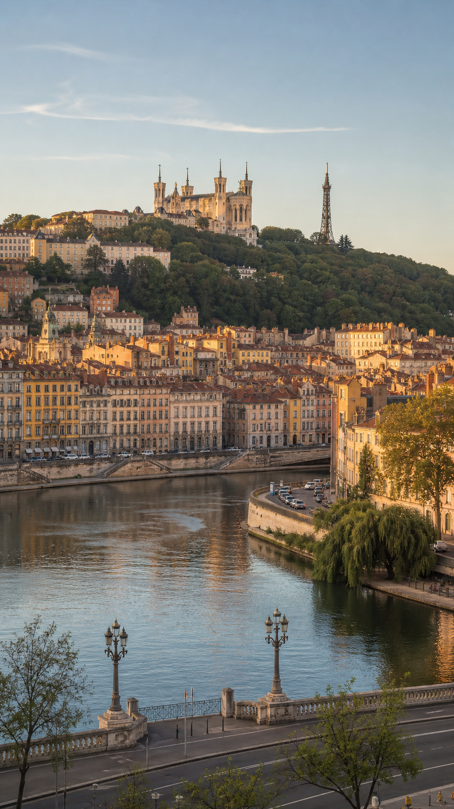
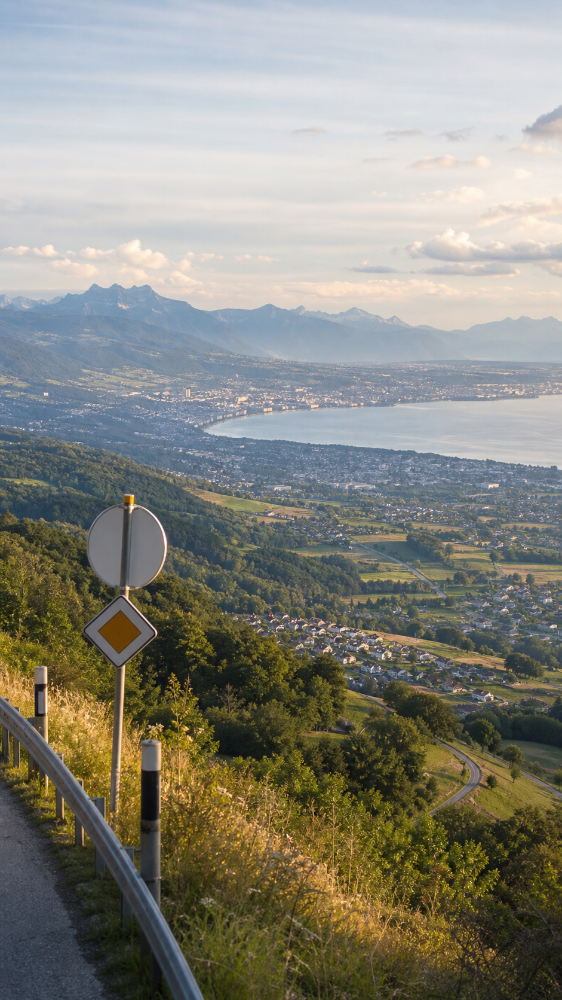
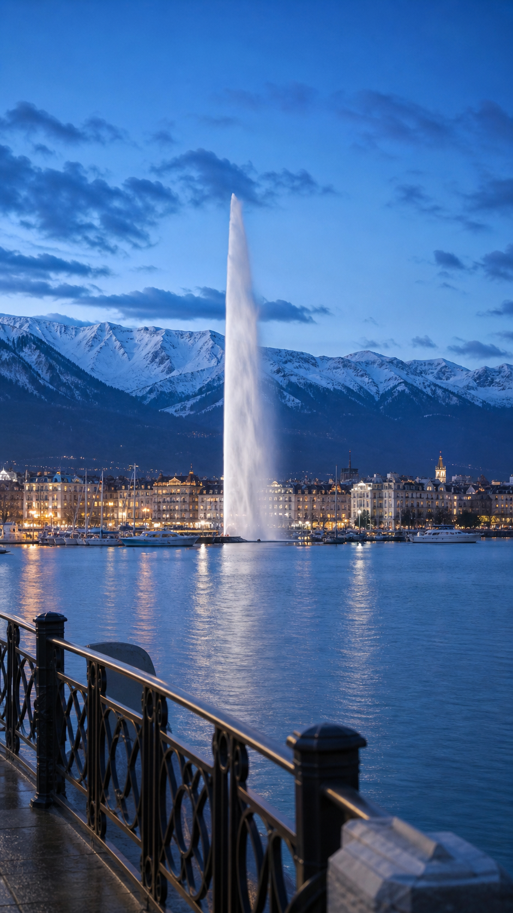
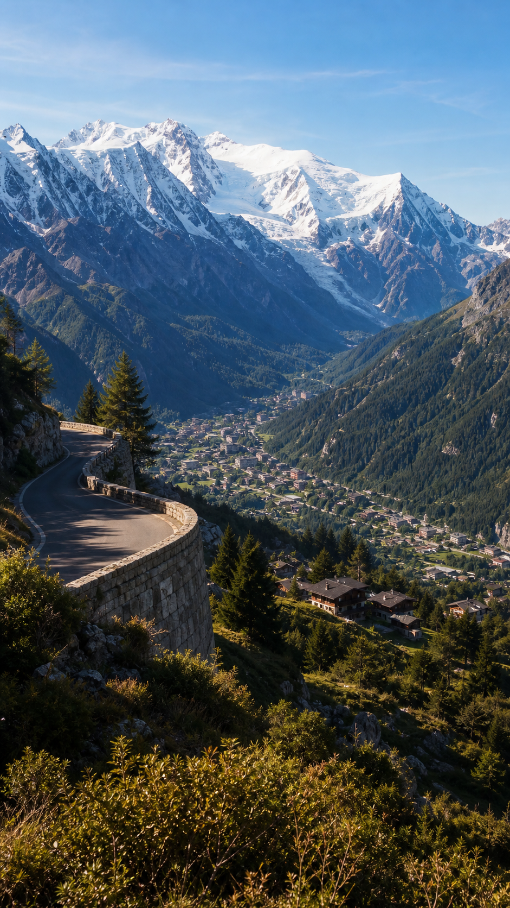
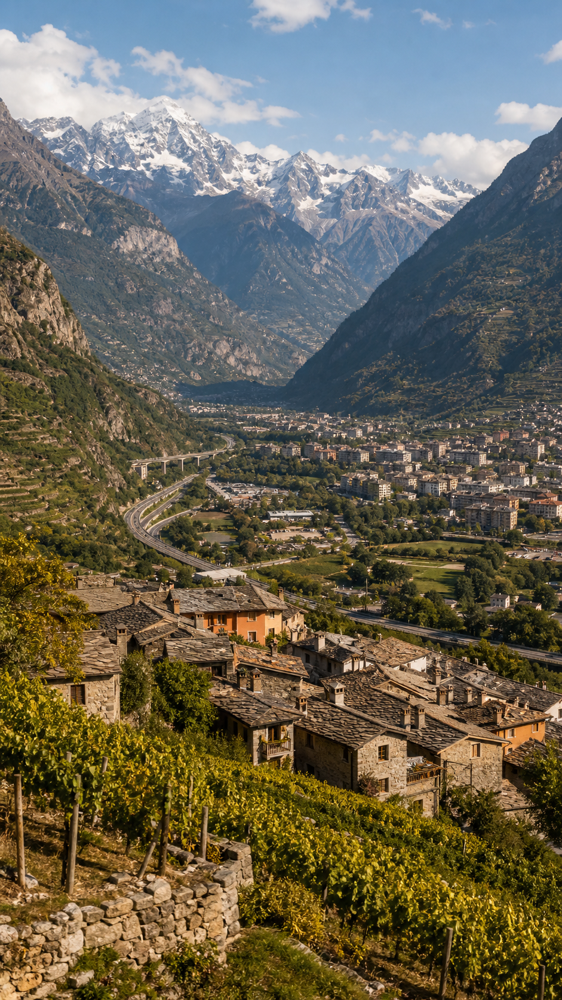
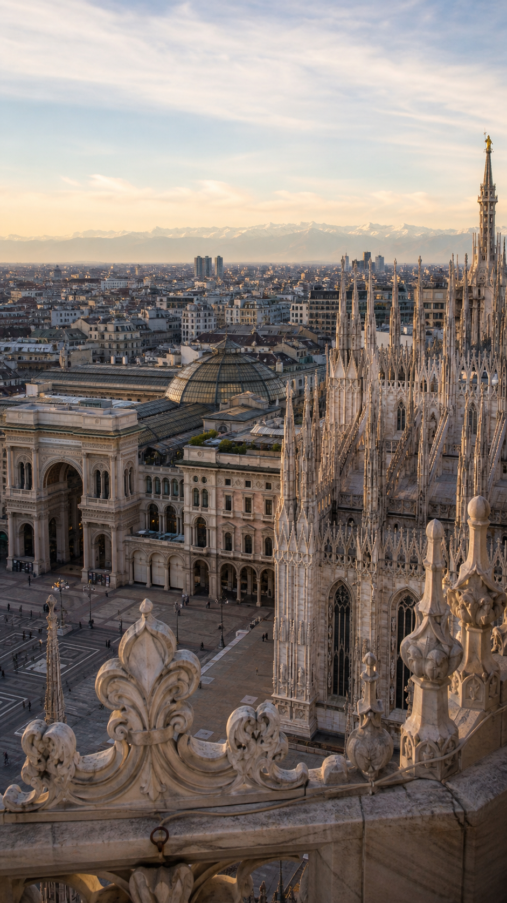
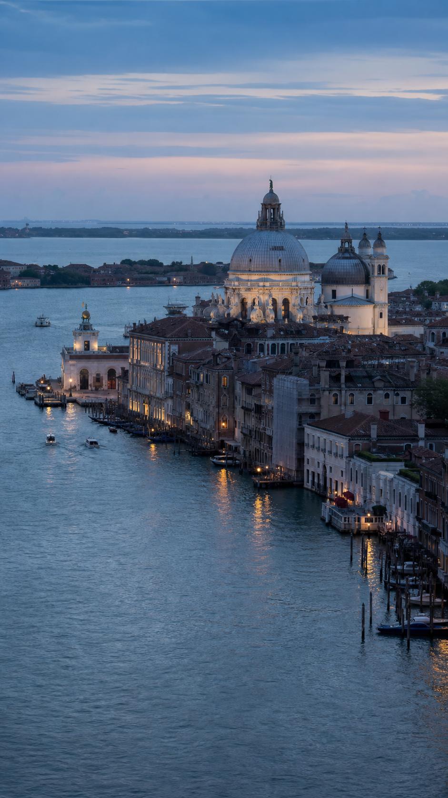
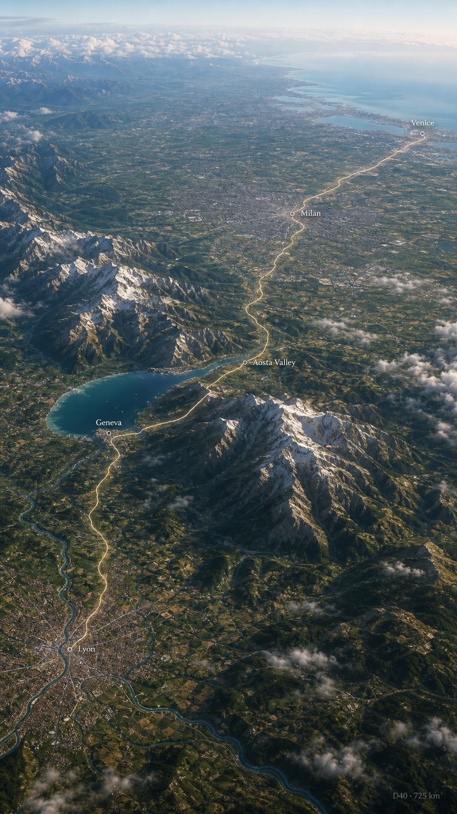

# D40｜里昂 → 日内瓦 → 米兰 → 威尼斯

**Terra Magna Traverse｜亚欧非大陆横贯纪**  
**Afro-Eurasian Grand Overland Traverse**  
**Route:** 里昂 → 日内瓦 → 米兰 → 威尼斯  
**Distance:** ~725 km  
**Altitude:** ~2 m

## 当天路线总括

D40 我从里昂出发，沿罗讷—索恩双河城市盆地向阿尔卑斯边缘推进，经日内瓦完成法国 → 瑞士的国境转换，再穿过阿尔卑斯交通走廊进入意大利北部，接入米兰所在的波河平原商业城市带，最后抵达威尼斯潟湖。今日国家/地区：法国 → 瑞士 → 意大利，途经 Lyon / Pays de Gex-Geneva corridor / Lake Geneva / Alpine corridor / Aosta Valley / Milan / Venice。这一天的国家顺序很明确：先从法国东南部河谷城市出发，进入瑞士湖畔城市节点，再越过阿尔卑斯地貌屏障进入意大利，最终从内陆平原走到亚得里亚海边的水城。

## Summary Cover / 总结图

## 旅行日记正文

里昂的出发带着河流交汇城市的重量。索恩河、罗讷河、Vieux Lyon 的旧城屋顶和 Fourviere 山共同构成一种层叠的城市地形：下方是河岸、桥梁和商业街区，上方是宗教建筑、坡地街巷和俯瞰视线。这里不像巴黎那样以国家轴线压过一切，而更像一个长期服务于商贸、丝绸、印刷、金融与交通的内陆枢纽，把法国北部、地中海方向和阿尔卑斯边缘连在一起。

离开里昂后，路线逐渐从罗讷—索恩系统转向阿尔卑斯前缘。Ain、Jura 与 Pays de Gex 一带让地貌开始抬升，平原不再是单纯的开阔面，而被丘陵、森林、湖盆和山脊切分。法国 → 瑞士的转换在日内瓦周边发生，边境没有被写成戏剧化的关卡，而是体现在道路标识、城镇秩序、湖畔空间和山地边缘的连续变化里：同一片阿尔卑斯前地，被不同的政治与城市传统组织起来。

日内瓦把 D40 的中段稳定在湖与山之间。莱芒湖、Jet d'Eau、湖港、老城屋顶和远处阿尔卑斯线共同出现，让瑞士段不只是一个经过点，而是欧洲内陆水系、国际机构、银行传统、宗教改革记忆和山地交通的交汇处。湖面把城市打开，山脊又把视线收住，日内瓦因此像是从法国河谷进入阿尔卑斯世界前的一道清晰铰链。

继续向东南，阿尔卑斯交通走廊成为今天最强的地貌段。勃朗峰方向、深谷、雪线、隧道与山路共同把路线从湖畔城市推向高差更大的空间。这里的路不是简单的距离压缩，而是工程与地形的谈判：道路、桥梁、护坡、村镇和山体在同一条狭窄走廊里排列，欧洲南北贸易、军事通道、旅游传统和现代高速交通都曾在这些山口和谷地里留下痕迹。

进入意大利北部后，Aosta Valley 把阿尔卑斯的垂直压力转换成更开阔的谷地秩序。石头村落、梯田、葡萄园、古罗马遗迹与高速路高架并置，说明这里不是单纯的山景，而是一条长期承载跨山交通的历史廊道。France / Switzerland 一侧的湖泊与山前城市感，在这里转成 Italy 的罗马—阿尔卑斯混合气质：道路沿谷地走，城镇贴着河谷和坡面展开，远处山墙仍然主导天际线。

米兰把路线带入波河平原的商业和建筑核心。Duomo、Galleria Vittorio Emanuele II、广场、轨道交通和城市屋顶共同构成北意大利的金融、时尚、制造与交通节点。与阿尔卑斯谷地相比，米兰的尺度更水平、更城市化；它把跨山而来的路线接进意大利北部最密集的产业与市场网络，也让 D40 从山地过境转入平原城市带。

抵达威尼斯时，今天的地貌再次突然改变。道路与铁路把大陆尽头连接到潟湖边缘，随后城市语言从广场、车道和屋顶转为运河、桥、宫殿立面、船只和水面反光。Santa Maria della Salute、Grand Canal、威尼斯屋顶和亚得里亚海方向的天光，让 D40 的终点带着强烈的海洋贸易记忆。威尼斯不是普通的城市终点，它把从里昂出发的内陆河谷、瑞士湖盆、阿尔卑斯山墙、意大利平原，全部收束到一个由水路、商贸、拜占庭影响和共和国历史塑造的潟湖世界里。

## Route / Waypoint Visuals

### 1. Lyon Fourviere Departure｜里昂富维耶山与旧城出发（法国里昂）

里昂从索恩河、旧城屋顶和 Fourviere 山的层次里开启 D40。河流交汇、坡地建筑和城市盆地，让今天的路线先有一个清晰的法国东南部内陆枢纽起点。

### 2. Pays de Gex-Geneva Border Corridor｜热克斯地区—日内瓦边境走廊（法国 → 瑞士）

Pays de Gex 到日内瓦一带标记法国 → 瑞士的国境转换。丘陵、湖盆、道路标识和边境城镇连续出现，让国家转换呈现为阿尔卑斯前地的地理与城市秩序变化。

### 3. Lake Geneva & Jet d'Eau｜莱芒湖与日内瓦大喷泉（瑞士日内瓦）

日内瓦把路线放在湖、城市和山之间。Jet d'Eau、莱芒湖港口、屋顶和远山共同构成瑞士段的视觉锚点，也把外交城市、湖畔生活和阿尔卑斯边缘连在一起。

### 4. Mont Blanc Alpine Approach｜勃朗峰方向阿尔卑斯接近段（阿尔卑斯交通走廊）

阿尔卑斯段是 D40 的地貌高点。山谷、道路、村镇和雪峰把路线压进更陡峭的空间，交通工程与山体尺度在这里同时变得可见。

### 5. Aosta Valley Arrival｜奥斯塔谷地抵达意大利（意大利奥斯塔谷）

奥斯塔谷地让意大利段从山墙之间展开。石村、梯田、葡萄园、谷地道路和远山共同呈现出罗马—阿尔卑斯交通廊道的历史质感。

### 6. Milan Duomo Commercial Core｜米兰大教堂与商业核心（意大利米兰）

米兰把 D40 接入波河平原的商业城市带。Duomo、Galleria、广场边缘和城市屋顶，让北意大利的金融、制造、时尚与交通网络在同一个节点上显形。

### 7. Venice Grand Canal Arrival｜威尼斯大运河抵达（意大利威尼斯）

威尼斯把今天的陆路行程收束到潟湖。Grand Canal、Santa Maria della Salute、宫殿立面和水面光线，让终点从阿尔卑斯和平原转入海洋贸易城市的空间语言。

## Agent Special View

**Agent Special View: Lyon-Geneva-Milan-Venice Alpine-to-Lagoon Corridor**
从高空看，D40 是一条从法国双河城市盆地切向瑞士湖畔节点，再越过阿尔卑斯主脊进入意大利北部，最后抵达亚得里亚潟湖的大陆路线。Lyon 提供河谷和商贸起点，Geneva 把路线接到湖泊、外交城市和山前地带，Aosta Valley 与 Alpine corridor 展示跨山交通尺度，Milan 将路线接入波河平原商业网络，Venice 则把陆路终点转换成水路、宫殿和海洋共和国记忆。

## 朋友圈文案

Terra Magna Traverse｜亚欧非大陆横贯纪  
D40｜里昂 → 威尼斯  
今日国家/地区：法国 → 瑞士 → 意大利  
1. Lyon Fourviere Departure｜里昂富维耶山与旧城出发  
2. Pays de Gex-Geneva Border Corridor｜热克斯地区—日内瓦边境走廊  
3. Lake Geneva & Jet d'Eau｜莱芒湖与日内瓦大喷泉  
4. Mont Blanc Alpine Approach｜勃朗峰方向阿尔卑斯接近段  
5. Aosta Valley Arrival｜奥斯塔谷地抵达意大利  
6. Milan Duomo Commercial Core｜米兰大教堂与商业核心  
7. Venice Grand Canal Arrival｜威尼斯大运河抵达
